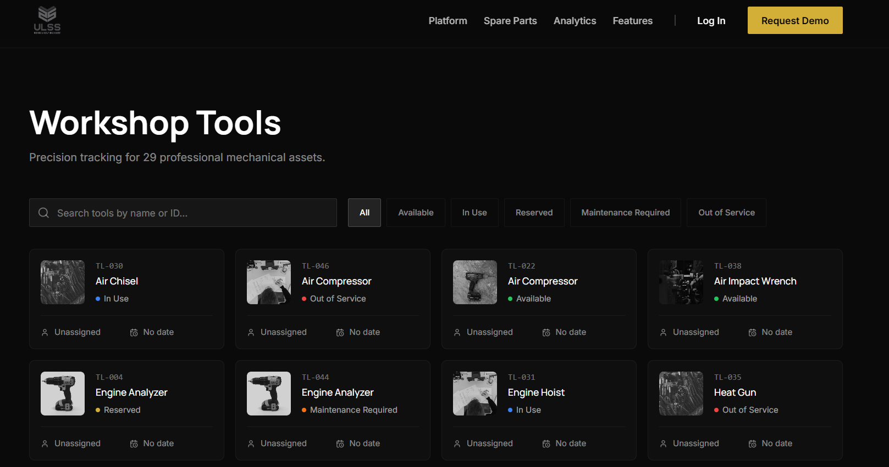
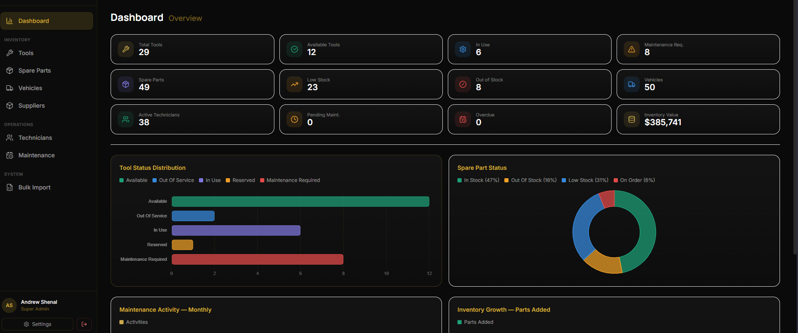
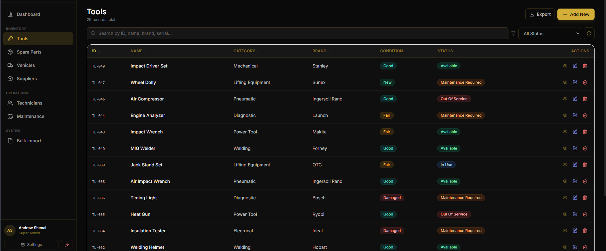
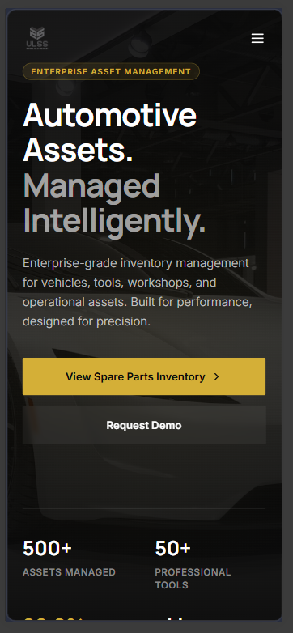

# 🚀 InventoryMate

> A professional Inventory Management System developed for a real client to manage stock levels, product records, inventory transactions, supplier information, and reporting through a centralized and scalable platform.


<!-- Tip: a 1280x640px screenshot of your app's hero/dashboard works great as a banner -->

[]([YOUR_DEPLOYED_URL_HERE](https://ulss-spareparts.vercel.app/))
[](YOUR_POSTMAN_COLLECTION_URL_HERE)
[](YOUR_GITHUB_REPO_URL_HERE)

---

## 📌 Table of Contents

- [Overview](#overview)
- [Screenshots](#screenshots)
- [Features](#features)
- [Tech Stack](#tech-stack)
- [Getting Started](#getting-started)
- [Environment Variables](#environment-variables)
- [API Endpoints](#api-endpoints)
- [Deployment](#deployment)
- [Author](#author)

---

## 🧭 Overview

[Write 3–5 sentences here. What problem does this solve? Who uses it? What makes it different from a basic CRUD app? Be specific about real-world value.]

**Live URL:** [https://your-app.vercel.app](https://your-app.vercel.app)  
**Backend API:** [https://your-api.onrender.com](https://your-api.onrender.com)

---

## 📸 Screenshots

### Home / Landing Page

<!-- Replace with your actual screenshot path -->

### Dashboard


### [Key Feature — e.g. Product Listing / User Profile / Order Flow]


### Mobile View

<!-- Optional but impressive — shows you think responsively -->

> 📁 Add all screenshots to a `/screenshots` folder in your repo root.

---

## ✨ Features

### 👤 User
- [ ] [Feature 1 — e.g. Register and log in with JWT authentication]
- [ ] [Feature 2 — e.g. View and manage personal profile]
- [ ] [Feature 3]
- [ ] [Feature 4]

### 🛠️ Admin
- [ ] [Admin Feature 1 — e.g. Full CRUD on products/users]
- [ ] [Admin Feature 2 — e.g. Dashboard with analytics]
- [ ] [Admin Feature 3]

### ⚙️ System
- [ ] Role-based access control (e.g. User / Admin)
- [ ] JWT authentication with secure HTTP-only cookies
- [ ] Input validation and error handling
- [ ] [Any other system-level feature — e.g. Email notifications, file uploads, pagination]

---

## 🛠️ Tech Stack

| Layer        | Technology                          |
|--------------|--------------------------------------|
| Frontend     | React.js, [Tailwind CSS / Bootstrap / MUI] |
| Backend      | Node.js, Express.js                 |
| Database     | MongoDB, Mongoose ODM               |
| Auth         | JWT, bcrypt                         |
| File Upload  | [Multer / Cloudinary — if used]     |
| Deployment   | [Vercel / Render / Railway / AWS]   |
| Other        | [Any other lib — e.g. Nodemailer, Socket.io, dotenv] |

---

## 🚦 Getting Started

### Prerequisites

Make sure you have these installed:

- [Node.js](https://nodejs.org/) v18+
- [npm](https://www.npmjs.com/) or [yarn](https://yarnpkg.com/)
- [MongoDB](https://www.mongodb.com/) (local) or a [MongoDB Atlas](https://www.mongodb.com/atlas) account
- [Git](https://git-scm.com/)

---

### 1. Clone the Repository

```bash
git clone https://github.com/YOUR_USERNAME/YOUR_REPO_NAME.git
cd YOUR_REPO_NAME
```

---

### 2. Set Up the Backend

```bash
cd backend
npm install
```

Create a `.env` file in the `/backend` directory (see [Environment Variables](#environment-variables) below), then:

```bash
# Development (with auto-restart)
npm run dev

# Production
npm start
```

Backend runs on: `http://localhost:YOUR_PORT`

---

### 3. Set Up the Frontend

```bash
cd ../frontend
npm install
npm run dev
```

Frontend runs on: `http://localhost:5173`

---

## 🔐 Environment Variables

Create a `.env` file inside `/backend`:

```env
PORT=YOUR_PORT
NODE_ENV=development

# MongoDB
MONGO_URI=your_mongodb_connection_string

# JWT
JWT_SECRET=your_jwt_secret_key
JWT_EXPIRES_IN=7d

# Cloudinary (if used)
CLOUDINARY_CLOUD_NAME=your_cloud_name
CLOUDINARY_API_KEY=your_api_key
CLOUDINARY_API_SECRET=your_api_secret

# Email (if used)
EMAIL_USER=your_email@gmail.com
EMAIL_PASS=your_app_password

# Add any other keys your project uses
```

> ⚠️ Never commit your `.env` file. It is already listed in `.gitignore`.

---

## 🔌 API Endpoints

**Base URL:** `http://localhost:YOUR_PORT/api/v1`  
**Postman Collection:** [View on Postman](YOUR_POSTMAN_COLLECTION_URL_HERE)

---

### Auth Routes — `/api/v1/auth`

| Method | Endpoint    | Description         | Access |
|--------|-------------|---------------------|--------|
| POST   | `/register` | Register a new user | Public |
| POST   | `/login`    | Login and get token | Public |
| POST   | `/logout`   | Logout user         | Auth   |

---

### [Resource 1] Routes — `/api/v1/[resource]`

> Replace `[resource]` with your actual resource (e.g. `users`, `products`, `orders`)

| Method | Endpoint  | Description          | Access |
|--------|-----------|----------------------|--------|
| GET    | `/`       | Get all [resources]  | Public / Auth |
| GET    | `/:id`    | Get single [resource]| Public / Auth |
| POST   | `/`       | Create [resource]    | Admin  |
| PUT    | `/:id`    | Update [resource]    | Admin  |
| DELETE | `/:id`    | Delete [resource]    | Admin  |

---

### [Resource 2] Routes — `/api/v1/[resource2]`

| Method | Endpoint  | Description          | Access |
|--------|-----------|----------------------|--------|
| GET    | `/`       | [Description]        | Auth   |
| POST   | `/`       | [Description]        | Auth   |

---

### Request & Response Examples

**POST** `/api/v1/auth/register`

```json
// Request body
{
  "name": "John Doe",
  "email": "john@example.com",
  "password": "securepassword123"
}

// Response
{
  "success": true,
  "message": "User registered successfully",
  "token": "eyJhbGciOiJIUzI1NiIsInR5cCI6IkpXVCJ9..."
}
```

> Add more examples for your key endpoints here.

---

### Authentication Header

Protected routes require a Bearer token:

```
Authorization: Bearer <your_jwt_token>
```

---

## 🚀 Deployment

### Frontend — Vercel

[](https://vercel.com/new)

1. Push your frontend to GitHub
2. Import the repo on [vercel.com](https://vercel.com)
3. Set environment variables in the Vercel dashboard
4. Deploy

**Live Frontend:** [https://your-app.vercel.app](https://your-app.vercel.app)

---

### Backend — Render / Railway

1. Push your backend to GitHub
2. Create a new Web Service on [render.com](https://render.com) or [railway.app](https://railway.app)
3. Set all environment variables
4. Set build command: `npm install` and start command: `npm start`

**Live API:** [https://your-api.onrender.com](https://your-api.onrender.com)

---

### Database — MongoDB Atlas

1. Create a free cluster on [mongodb.com/atlas](https://www.mongodb.com/atlas)
2. Whitelist `0.0.0.0/0` for deployment access
3. Copy the connection string into your `MONGO_URI` env variable

---

## 📁 Project Structure

```
root/
├── backend/
│   ├── config/
│   │   └── db.js                  # Database connection
│   ├── controllers/
│   │   └── [resource]Controller.js
│   ├── middlewares/
│   │   ├── authMiddleware.js
│   │   └── errorMiddleware.js
│   ├── models/
│   │   └── [Resource].js
│   ├── routes/
│   │   └── [resource]Routes.js
│   ├── utils/
│   │   └── [helpers].js
│   ├── .env                       # Not committed
│   ├── .gitignore
│   ├── package.json
│   └── server.js
│
├── frontend/
│   ├── public/
│   ├── src/
│   │   ├── assets/
│   │   ├── components/
│   │   ├── pages/
│   │   ├── hooks/
│   │   ├── context/               # or /store for Redux
│   │   ├── services/              # API call functions
│   │   ├── App.jsx
│   │   └── main.jsx
│   ├── .env
│   └── package.json
│
├── screenshots/                   # UI screenshots for README
│   ├── banner.png
│   ├── home.png
│   ├── dashboard.png
│   └── mobile.png
│
└── README.md
```

---

## 👨‍💻 Author

**Thisal Gonsalkorala**  
Full-Stack Software Engineer

[](https://profile.thisalg.online/)
[](https://www.linkedin.com/in/thisal-gonsalkorala/)
[](https://github.com/thisaldil)
[](mailto:tdimith10@gmail.com)

---

## 📄 License

This project is licensed under the [License](./LICENSE).

---

> Built with ☕ and TypeScript by Thisal Gonsalkorala
